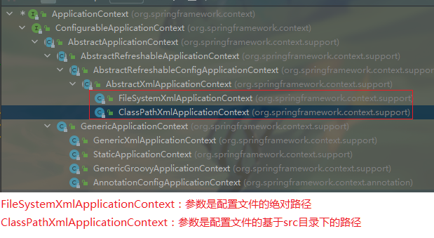
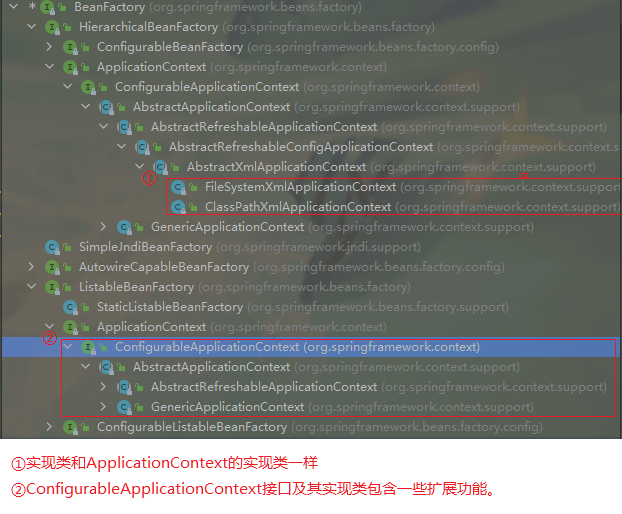
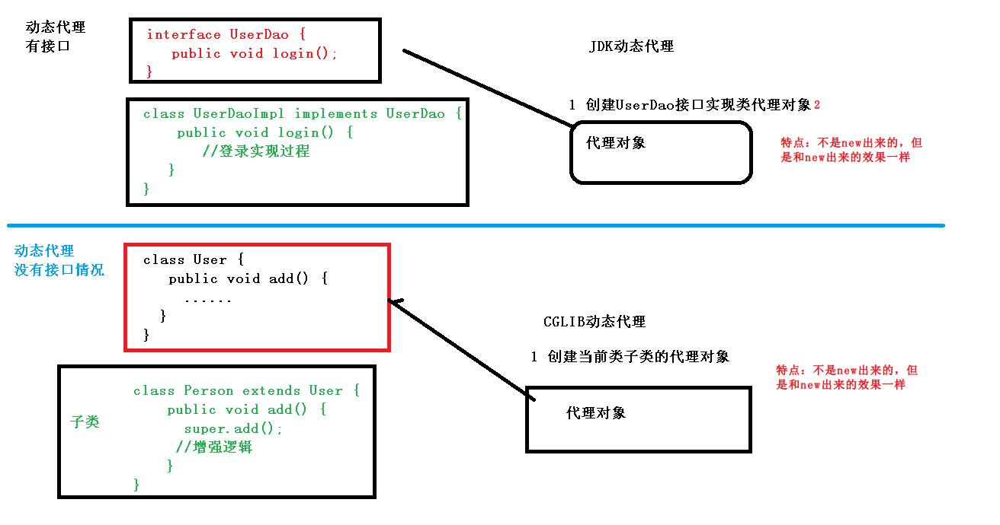

# Spring概念

##### 1、Spring框架是一个轻量级开源的JavaEE应用程序框架

​			`轻量级：依赖jar包数量比较少、体积比较小，使用过程中不依赖其他的组件，可以单独使用。`

##### 2、Spring可以解决企业应用开发的复杂性，即框架概念。

##### 3、Spring中两个核心部分：***IOC和AOP***

​	**IOC：**Inversion of Control `即控制反转。`

​		`作用：我们不用手动new来创建对象，而是把创建对象的过程交给Spring进行管理。`

​	**AOP：**`Aspect Oriented Programming即面向切面编程。`

​		`作用：不修改源代码进行功能增强`

##### 4、Spring框架特点

 + 方便解耦，简化开发
 + AOP编程支持
 + 方便程序的测试
 + 方便集成其他优秀框架 如Mybatis，HIbernate等
 + 方便进行事务操作
 + 降低API开发难度

------

# Spring入门案例

##### 1、spring版本 5.2.6GA

##### 2、下载地址：[repo.spring.io](https://repo.spring.io/ui/native/release/org/springframework/spring)

##### 3、建个普通Java工程

##### 4、导入spring框架基础包（必须的4个）

​	`Beans,Core,Context,Expression`


##### 5、使用spring方式创建对象，创建Spring配置文件，在配置文件配置要创建的对象。

 + Spring配置文件是xml格式

```Java
<!--配置User类的创建-->
<bean id="user" class="com.ly.spring5.User"></bean>
```

##### 6、测试代码

```java
 //1、加载spring的配置文件
ApplicationContext context = new ClassPathXmlApplicationContext("bean1.xml");
//2、获取配置要创建的对象
User user = context.getBean("user", User.class); 
user.add();
```

------

# IOC容器

容器本质上就是工厂

> IOC控制反转，把对象的创建和对象之间的调用过程，交给Spring进行管理。
>
> 使用IOC目的：降低耦合度
>
> 入门案例就是IOC实现

##### 1、IOC底层原理

演变：普通调用（高耦合） =>工厂模式（中耦合）==>IOC（低耦合）

> + xml解析
> + 工厂设计模式：解耦合
> + 反射

##### 2、IOC接口（BeanFactory）

`IOC思想基于IOC容器，而IOC容器底层就是对象工厂`

Spring提供IOC容器实现的两个方式：（两个接口）

​	(1)接口：BeanFactory

​		`Spring内置基本方式，一般是Spring内部使用，不建议Spring外部使用。`

​	(2)接口：ApplicationContext

​		`是BeanFactory接口的子接口，功能更多。建议开发人员使用的（即Spring外部）`

***两个接口的区别：***

> `1、BeanFactory在加载配置文件时不会同时创建配置文件类对象，仅在调用其方法时才会创建。`
>
> `2、ApplicationContext在加载配置文件的同时也会创建配置文件类对象。`
>
> 因此：推荐第二种，把创建对象等耗时耗资源都放在服务启动时。

***ApplicationContext实现类介绍:***



***BeanFactory实现类介绍：***



##### 3、IOC操作Bean管理（基于xml/基于注解）

`Bean管理：就是下面两个操作`

​	`（1）Spring创建对象 ，代替我们手动new`

​	`（2）Spring属性注入，代替类中的set方法`

###### 3.1、IOC操作Bean管理（基于xml）

​	***Bean管理基于xml方式创建对象*：**

​		2. `在Spring配置文件中，使用bean标签，标签里添加对应属性即可。`

```xml
<!-- bean标签下属性：
	id：表示类别名，即key 唯一标识
	class：全类名
	name:作用和id一样都是key，但是可以加入特殊符号，id不行
	autowire:自动注入，表示注入属性是选择
			byName :按属性名称注入
			byType:按类型进行注入
			bystructor:按照构造方法进行注入
			default：默认注入方式
-->
<bean id="user" class="com.ly.spring5.User"></bean>
```

​	2. `Spring创建对象，默认使用无参数构造器`

​	***Bean管理基于xml方式注入属性：***

​		`DI：Dependency Injection 是IOC容器中一种具体实现，表示依赖注入即注入属性。需要在创建对象的基础上实现。`

​		**Spring注入两种属性方式：即DI**

​		1. set方法注入属性

```xml
<!-- 在Spring配置文件中使用properties标签 完成属性注入-->
<bean id="book" class="com.ly.spring5.Book">
 	<!-- name属性表示Book类中的BookName属性，value表示给其赋值-->   
    <property name="bookName" value="猪猪侠"></property>
    <property name="author" value="GG BOY"></property>
</bean>
```

```java
//Spring框架获取注入属性
public void test1() {
    //1、加载配置文件
    ApplicationContext context = new ClassPathXmlApplicationContext("bean1.xml");

    //2、创建对象
    Book book = context.getBean("book", Book.class);
    System.out.println(book);
}
```

​		2. 有参构造器注入属性

```xml
<!--    有参构造器注入属性-->
<bean id="order" class="com.ly.spring5.Order">
    <!--        name 属性名称，value自己赋值-->
    <constructor-arg name="orderName" value="易筋经"></constructor-arg>
    <constructor-arg name="address" value="少林寺"></constructor-arg>
    <!-- 通过序号 也可以赋值-->
    <constructor-arg index="0" value="无相神功"></constructor-arg>
</bean>
```

```java
public void test2() {
    //1、加载配置文件
    ApplicationContext context = new ClassPathXmlApplicationContext("bean1.xml");

    //2、建立类对象 即调用构造器
    Order order = context.getBean("order", Order.class);
    System.out.println(order);
}
```

3、p标签注入(了解)，实际上就是set方法的简化

```xml
<!--1、使用p名称空间注入，可以简化基于xml的配置方法 ,需要在beans标签内加入p属性-->
<!-- 加入 xmlns:p="http://www.springframework.org/schema/p"  -->
<beans xmlns="http://www.springframework.org/schema/beans"
       xmlns:xsi="http://www.w3.org/2001/XMLSchema-instance"
       xmlns:p="http://www.springframework.org/schema/p" 
       xsi:schemaLocation="http://www.springframework.org/schema/beans http://www.springframework.org/schema/beans/spring-beans.xsd">
                           
    <!--    p标签 set方法注入属性-->
    <bean id="book" class="com.ly.spring5.Book" p:author="天龙八部" p:bookName="金庸"></bean> 
</beans>
```

***xml注入其他类型属性：***

​	==1、字面量：定义属性时赋值，或者通过<Property>的set方法复制的都均叫做字面量。==

​		(1)字面量为null，怎么操作？

```xml
<!--        set方法注入属性-->
<bean id="book" class="com.ly.spring5.Book">
    <!-- address属性设置控制，使用null标签-->
    <property name="address">
        <null/>
    </property>
</bean>
```

​		(2)字面量包含特殊符号，怎么做？

```xml
<!--        set方法注入属性，属性值可以拆开写-->
<!--        value为 <<南京>> 
            两种方法： 
                1、转义字符 < &lt   > &gt
                2、CDATA域 <![CDATA[文字域]]>
-->
        <property name="email">
            <value><![CDATA[<<南京>>]]></value>
        </property>
    </bean>
```

​	==2、注入属性  -  外部bean==

​		如：service层调用dao层

```xml
<!-- 使用Spring配置文件 service层调用dao层方法-->
<!--    注入属性 外部bean-->
<!--
        1、创建UserService和UserDAO对象
        2、给userService对象的userDao属性注入 外部bean对象 通过唯一id来完成
    -->
<bean id="userService" class="com.ly.service.UserService">
    <!-- rel指向bean标签的id-->
    <property name="userDao" ref="userDao">
    </property>
</bean>
<bean id="userDao" class="com.ly.dao.UserDaoImpl"></bean>
```

​	==3、注入内部bean和级联赋值==

​		举例：部门和员工的一对多关系

​		==内部bean==

```xml
<!--    Spring配置文件，注入内部bean-->
	<!-- 和emp中的 bean id="dept"不冲突，因为层级不同-->
    <bean id="dept" class="com.ly.bean.Dept">
        <property name="deptName" value=""></property>
    </bean>


    <bean id="emp" class="com.ly.bean.Employee">
        <property name="empName" value="张三"></property>
        <property name="empGender" value="男"></property>
        <property name="dep">
            <!--  bean写在属性里面就是内部bean ，如果写在外面用ref连接就是外部bean     -->
            <bean id="dept" class="com.ly.bean.Dept">
                <property name="deptName" value="财务部"></property>
            </bean>
        </property>
    </bean>
```

​	==级联赋值：== 同时向有关联的 属性类 数值（如上面的Employee类中的deptName属性）

​		`这里是直接引入外部bean，借助set方法`

```xml
<bean id="dept" class="com.ly.bean.Dept">
    <property name="deptName" value="哈哈哈"></property>
</bean>

<!--    级联赋值 外部bean-->
<bean id="emp" class="com.ly.bean.Employee">
    <property name="empName" value="张三"></property>
    <property name="empGender" value="男"></property>
    <property name="dep" ref="dept"></property>
</bean>
```

​	==级联赋值，外部bean属性值 第二种写法：==

​		`这里是直接引入外部bean属性，借助get和set方法`

```xml
<bean id="dept" class="com.ly.bean.Dept">
    <property name="deptName" value="哈哈"></property>
</bean>  
<!--    级联赋值 外部bean属性值 第二种写法-->
<bean id="emp1" class="com.ly.bean.Employee">
    <property name="empName" value="李四"></property>
    <property name="empGender" value="男"></property>
    <property name="dep" ref="dept"></property>
    <!--其实就是 类.属性 来赋值 
                dep表示  Employee类下的getDep方法，去掉了get 【get方法必须有对应返回值】
                depName 其实就是Dept类下的setDeptName方法-->
    //此处输出 保安部，因为覆盖了 哈哈 【原因他们是使用同一个Dept对象】
    <property name="dep.deptName" value="保安部"></property>
</bean>

<!--    级联赋值 外部bean-->
<bean id="emp1" class="com.ly.bean.Employee">
    <property name="empName" value="李四"></property>
    <property name="empGender" value="男"></property>
    //此处也会输出 保安部，因为覆盖了 哈哈 【原因他们是使用同一个Dept对象在整个xml文件中】
    <property name="dep" ref="dept"></property>
</bean>
```

​	==4、xml注入集合属性==

​		注入数组，List集合，Map集合，Set集合

```xml
    <bean id="stu" class="com.ly.spring5.Stu">
        <!--   注入数组属性     -->
        <property name="courses">
            <array>
                <value>英语</value>
                <value>语文</value>
                <value>数学</value>
                <value>化学</value>
            </array>
        </property>

        <!--   注入List集合属性     -->
        <property name="list" >
            <list>
                <value>list1</value>
                <value>list2</value>
                <value>list3</value>
            </list>
        </property>

        <!--   注入Map集合属性     -->
        <property name="maps" >
            <map>
                <entry key="k1" value="map1"></entry>
                <entry key="k2" value="map2"></entry>
                <entry key="k3" value="map3"></entry>
            </map>
        </property>

        <!--   注入Set集合属性     -->
        <property name="set" >
            <set>
                <value>set1</value>
                <value>set2</value>
            </set>
        </property>
    </bean>
```

​		细节1：集合里面设置对象类型

```xml
<bean id="stu" class="com.ly.spring5.collectionType.Stu">
	<!--   注入List集合 属性为类对象 -->
    <property name="courseList" >
        <list>
            //指向外部bean
            <ref bean="c1"></ref>
            <ref bean="c2"></ref>
        </list>
    </property>
    
    <!--   注入Map集合属性为类对象     -->
    <property name="mapCourse" >
        <map>
            //和List有些许不同  value-ref="c1"
            <entry key="k1" value-ref="c1"> </entry>
            <entry key="k1" value-ref="c2"> </entry>
        </map>
    </property>
</bean> 

//外部bean
<bean id="c1" class="com.ly.spring5.collectionType.Course">
    <property name="cname" value="语文"></property>
</bean>
<bean id="c2" class="com.ly.spring5.collectionType.Course">
    <property name="cname" value="数学"></property>
</bean>
```

​		细节2：集合注入参数为公共参数，提取出来 ==其实就是外部bean方法，通过ref连接==

   + 在Spring配置文件中，引入名称空间 （util）

     ```xml
     <beans xmlns="http://www.springframework.org/schema/beans"
            xmlns:xsi="http://www.w3.org/2001/XMLSchema-instance"
            xmlns:util="http://www.springframework.org/schema/util"
            xsi:schemaLocation="http://www.springframework.org/schema/beans http://www.springframework.org/schema/beans/spring-beans.xsd 
                                 http://www.springframework.org/schema/util http://www.springframework.org/schema/util/spring-util.xsd">
     
         <!--  新增两个部分：
       		1、xmlns：util...
     		2、xsi:schemaLocation...util.. //bean全换成util-->
     </beans>
     ```

   + 使用util标签完成List集合注入提取

     ```xml
     <!--  外部bean    [list集合  注意：需要是同一个类型的才行]-->
         <bean id="course" class="com.ly.spring5.collectionType.Course">
             <property name="cname" value="物理"></property>
         </bean>
         <!--  list集合注入属性，提取出公共部分  -->
         <util:list id="list2">
             <value>list集合</value>
             <value>哈哈</value>
         </util:list>
     	<!-- --写两个是为了区分 List集合只能放同一类型对象>
         <util:list id="bookList">
             <ref bean="course"></ref>
         </util:list>
     
         <!--   list集合注入属性 通过ref   [list集合  注意：需要是同一个类型的才行]-->
         <bean id="book" class="com.ly.spring5.collectionType.Book">
             <property name="list" ref="bookList"></property>
         </bean>
     ```

###### 3.2、IOC操作Bean管理-- 工厂bean（FactoryBean）

注意：FactoryBean非IOC接口BeanFactory，它本质上是Bean。

+ `Spring中有两种类型bean，一种普通bean就是我们创建出来的（基于xml或注解），另一种就是工厂bean（FactoryBean）Spring自带的。`
+ `普通Bean：在Spring配置文件中配置是什么类型的，返回就是什么类型的！   如：定义Book类，返回就是Book类`
+ `工厂Bean：定义类型和返回类型可以不一样！   如：定义Book类，可以返回Store类`

> ==FactoryBean使用步骤：==
>
> 1. `创建类，让这个类作为FactoryBean，需要让其实现接口FactoryBean（接口就是这个名字.）`
>
> 2. `实现接口中的方法，在实现方法中定义返回的bean类型`
>
> 3. 实际使用context,getBean("id",bean.class)就需要改成实际的bean
>
>    ```java
>    //指定泛型 Course
>    public class MyBean implements FactoryBean<Course>{
>        @Override
>        public Course getObject() throws Exception {
>            //定义返回bean
>            Course course = new Course();
>            course.setCname("abc");
>            return course;
>        }
>        @Override
>        public Class<?> getObjectType() {
>            //返回bean类型
>            return null;
>        }
>        @Override
>        public boolean isSingleton() {
>            //是否为单例
>            return false;
>        }
>    }
>    //xml配置
>    <bean id="myBean" class="com.ly.spring5.collectionType.facbean.MyBean"></bean>
>                 
>    //实际使用获取不同于配置文件的Bean类型,需要传入想要的类class
>    //获取目标bean
>    Course myBean = context.getBean("myBean", Course.class);
>    //获取工厂Bean本身
>    MyBean bean = context.getBean("&myBean", MyBean.class);
>    ```
>
>    ==FactoryBean作用：==`FactoryBean 通常是用来创建比较复杂的bean，一般的bean 直接用xml配置即可，但如果一个bean的创建过程中涉及到很多其他的bean 和复杂的逻辑，用xml配置比较困难，这时可以考虑用FactoryBean。`
>
>    `使用FactoryBean创建隐藏了一些实例化bean的细节，给上层应用带来便利.`

###### 3.3、IOC操作Bean管理 （Bean作用域）

在Spring里面可以设置创建的bean是单实例还是多实例。Spring中默认创建的bean都是单实例对象。

单实例：只有一个对象，每次返回都是同一个对象 （可以通过HashCode来判断）

​			`修改一个对象的属性值，另一个对象的属性值也会变成一样。因为本身就是同一个对象！`

多实例：每次返回都会创建一个新对象

**设置bean为多实例：**

> Spring配置文件中bean标签里有个属性 Scope，用于设置是否为多实例
>
> ```xml
> scope="prototype" <!-- 多实例对象-->
> scope="singleton" <!-- 单实例对象-->
> scope="request" <!-- 创建对象放在，request域中（了解）--> 
> scope="session" <!--  创建对象放在，session域中（了解）-->
> ```

​	singleton和prototype区别：

 + singleton为单实例，prototype为多实例
 + ==设置scope="singleton"时，加载Spring配置文件时就会创建单实例对象。==
 + ==设置scope="prototype"时，不是在加载spring配置文件时创建实例对象，而是在调用getBean方法时创建多实例对象。==

###### 3.4、IOC操作Bean管理 （Bean生命周期）

生命周期：对象从创建到销毁的过程

***bean生命周期：***

> （1）通过构造器创建bean实例（无参数构造）
>
> （2）为bean属性赋值，和对其他bean的引用（通过该类的set方法） 【xml文件中的】
>
> （3）调用bean的初始化的方法（需要进行配置）
>
> （4）使用bean对象实例（对象我们已经获取到了）
>
> （5）当容器关闭时候（可以手动调用close方法），调用bean的销毁方法（需要进行配置）
>
> ```xml
> //init-method 指定bean的初始化方法  (Orders类中的)
> //destroy-method  指定bean的销毁方法 (Orders类中的)
> <bean id="orders" class="com.ly.spring5.bean.Orders" init-method="initMethod" destroy-method="destroy">
>     <property name="oname" value="手机"></property>
> </bean>
> ```

***bean生命周期 --前置/后置处理器***

更详细的生命周期，可以细分为7步：`（在调用第3步之前和之后分别会调用后置处理器）`

`前置处理器和后置处理器为同一个方法，只要一个类实现了接口BeanPostProcessor，那么Spring就将其视作处理器。`

*==后置处理器需要单独建立一个类来实现接口BeanPostProcessor，然后在配置文件中配置（和普通bean的配置方法一样），然后Spring在加载配置文件时会把bean创建，同时把前置/后置处理器创建，同时前置/后置处理器会对当前配置文件中的所有bean生效==*

> （1）通过构造器创建bean实例（无参数构造）
>
> （2）为bean属性赋值，和对其他bean的引用（通过该类的set方法） 【xml文件中的】
>
> ==把bean实例传递给bean的前置处理器：== `postProcessBeforeInitialization()方法`
>
> （3）调用bean的初始化的方法（需要进行配置）
>
> ==把bean实例传递给bean的后置处理器的：== `postProcessAfterInitialization()方法`
>
> （4）使用bean对象实例（对象我们已经获取到了）
>
> （5）当容器关闭时候（可以手动调用close方法），调用bean的销毁方法（需要进行配置）
>
> ```java
> //为了使用bean的前置/后置处理器，需要将类实现 接口BeanPostProcessor 的两个方法
> public class MyBeanPost implements BeanPostProcessor {
> 
>     @Override
>     //初始化前调用
>     public Object postProcessBeforeInitialization(Object bean, String beanName) throws BeansException {
>         System.out.println("执行bean初始化方法前调用");
>         //bean就是创建出来的bean对象
>         return bean;
>     }
> 
>     @Override
>     //初始化后调用
>     public Object postProcessAfterInitialization(Object bean, String beanName) throws BeansException {
>         System.out.println("执行bean初始化方法后调用");
>         //bean就是创建出来的bean对象
>         return bean;
>     }
> }
> 
> ```
>
> ```xml
> <!-- 实现的接口BeanPostProcessor 告诉Spring这是前置/后置处理器，不是普通bean-->
> <bean id="orders" class="com.ly.spring5.bean.Orders" init-method="initMethod" destroy-method="destroy" >
>     <property name="oname" value="手机"></property>
> </bean>
> <!--  配置后置处理器bean  -->
> <bean id="myBeanPost" class="com.ly.spring5.bean.MyBeanPost"></bean>
> ```
>
> 

###### 3.5、IOC操作Bean管理（基于xml的 自动装配）

​	什么是自动装配？

​	答：`通过配置文件的property标签向一个类中注入属性的操作，叫做手动装配。`

​			==`不需要在配置文件中写入property标签，Spring会根据属性类型或属性名称自动完成属性值注入的过程叫做自动装配！`==

```xml
    <!--  自动装配/注入
        autowire:自动注入，表示注入属性是选择
         byName :按属性名称注入 【要注入值的属性（如Emp类中的Dept dept）的名字，必须要和xml中bean（如：Dept类）的id值完全相同才可以】
         byType:按类型进行注入 【同一个xml配置文件中不能有多个相同类型的bean（尽管id不同）,否则Spring会报错】
         bystructor:按照构造方法进行注入
         default：默认注入方式
         -->
    <bean id="emp" class="com.ly.spring5.autowire.Emp" autowire="byName">
        <!-- 手动装配/注入-->
<!--        <property name="dept" ref="dept"></property>-->
    </bean>


    <bean id="dept" class="com.ly.spring5.autowire.Dept"></bean>
	<!-- 如果自动注入规则为byType，则此时会报错，因为要注入的类型bean重复-->
	<bean id="dept1" class="com.ly.spring5.autowire.Dept"></bean>
```

###### 3.6、IOC操作Bean管理（外部属性文件）

即把属性的配置写在外部文件中，不再放在xml中的property标签。

```xml
<!--如数据库配置信息，普通方法直接配置-->
<bean id="dataSource" class="com.alibaba.druid.pool.DruidDataSource">
    <property name="driverClassName" value="com.mysql.jdbc.Driver"></property>
    <property name="url" value="jdbc:mysql://localhost:3306/userDb"></property>
    <property name="username" value="root"></property>
    <property name="password" value="123456"></property>
</bean>

```

```xml
<!--外部属性配置文件，xml配置文件引入-->
<beans xmlns="http://www.springframework.org/schema/beans"
       xmlns:xsi="http://www.w3.org/2001/XMLSchema-instance"
       xmlns:context="http://www.springframework.org/schema/context"
       xsi:schemaLocation="http://www.springframework.org/schema/beans http://www.springframework.org/schema/beans/spring-beans.xsd
                            http://www.springframework.org/schema/context http://www.springframework.org/schema/context/spring-context.xsd">

        <bean id="dataSource" class="com.alibaba.druid.pool.DruidDataSource">
            <property name="driverClassName" value="${prop.driverClassName}"></property>
            <!-- ${} 引入properties文件属性，里面放的是properties等号=左边的值-->
            <property name="url" value="${prop.url}"></property>
            <property name="username" value="${prop.username}"></property>
            <property name="password" value="${prop.password}"></property>
        </bean>


    <!--如数据库配置信息，引入外部配置文件配置,借助context名称空间
        xmlns:context="http://www.springframework.org/schema/context"

        xsi:schemaLocation="http://www.springframework.org/schema/beans http://www.springframework.org/schema/beans/spring-beans.xsd
                            http://www.springframework.org/schema/context http://www.springframework.org/schema/context/spring-context.xsd"
    -->
    <context:property-placeholder location="classpath:jdbc.properties"></context:property-placeholder>
</beans>
```

###### 3.7、IOC操作Bean管理（基于注解）

​	什么是注解？

​	答：`1、注解是代码特殊标记，格式：@注解名称(属性名1=属性值1,属性名2=属性值2)`

​			`2、注解可以用于：类上，方法上，属性上`

​			`3、使用注解是为了简化xml配置`

​	***Bean管理 -- 创建对象：***

```java
/*使用注解创建对象 共四种方法 (默认都是单实例)
	@Component  表示Spring容器中	普通的对象可以用其创建
	@Service	一般用于业务逻辑层/service层
	@Controller	一般用于web层上
	@Repository	一般用于dao层上
*/
```

​	*注解使用步骤：*

​		1、引入依赖包  spring-aop-5.2.6.RELEASE.jar

​		2、必须开启组件扫描 （是为了告诉Spring容器，在哪个类里面加上注解，扫描指定包/文件下的类），`即引入context名称空间 + 开启组件扫描`

```xml
<beans xmlns="http://www.springframework.org/schema/beans"
       xmlns:xsi="http://www.w3.org/2001/XMLSchema-instance"
       xmlns:context="http://www.springframework.org/schema/context"
       xsi:schemaLocation="http://www.springframework.org/schema/beans http://www.springframework.org/schema/beans/spring-beans.xsd
                        http://www.springframework.org/schema/context http://www.springframework.org/schema/context/spring-context.xsd">
    
    <!-- 开启组件扫描
        扫描多个包：
            方法1：逗号隔开
            方法2：写公共父目录

	开启组件组件扫描细节：
 			如：可以进行细致配置同一个包下，哪些可以扫描，哪些不可以扫描
-->
    <context:component-scan base-package="com.ly.spring5.service,com.ly.spring5.dao"></context:component-scan>
    <context:component-scan base-package="com.ly.spring5"></context:component-scan>
    
    //实例1
    <!-- 加上use-default-filters="false" 表示不使用默认的Spring方法进行扫描，如果没加上就是默认使用 -->
    <context:component-scan base-package="com.ly.spring5" use-default-filters="false">
        <!-- include包含，指定只扫描com.ly.spring目录下，类型是注解的Component 的类 -->
        <context:include-filter type="annotation" expression="org.springframework.stereotype.Component"/>
    </context:component-scan>
    
    
    //实例2
    <!--使用默认扫描规则 -->
    <context:component-scan base-package="com.ly.spring5">
        <!-- 指定不扫描 com.ly.spring5目录下的 注解annotation类型为Component的类-->
        <context:exclude-filter type="annotation" expression="org.springframework.stereotype.Component"/>
    </context:component-scan>
    
</beans>
```

​		3、创建被使用类（不是Test类），引入注解

```java
//value可以省略不写，默认就是类名（首字母小写）
@Component(value = "userService") ////就是<bean id="" class="">
public class UserService {

    public void add() {
        System.out.println("add 方法");
    }
}
```

​		4、使用注解类

```java
public void test(){
    ApplicationContext context = new ClassPathXmlApplicationContext("bean1.xml");
    UserService userService = context.getBean("userService", UserService.class);
    userService.add();
}
```

***Bean管理 -- 属性注入：***

```java
/*  
	@AutoWired  根据属性类型 自动注入  【针对对象类型。普通类型不可用】
	@Qualifier	根据属性名称进行注入，必须和AutoWired注解一起使用	【针对对象类型。普通类型不可用】
	@Resource	可以根据属性名称，属性类型进行注入	【针对对象类型。普通类型不可用int,Integer等】
	
	@Value	注入普通类型属性  【针对普通类型int,Integer等】
*/
```

*注解使用步骤：*

​	1、创建service类和dao类，并使用相应注解（@Service  @Repository）

​	2、在service里添加dao属性，并在上面，使用@AutoWired注解

```java
//根据类型注入
//定义dao类型属性   不需要添加set方法，因为注解里面已经封装好了
@Autowired
private UserDaoImpl userDao;//按实现类定义
```

```java
//根据名称注入 [一个接口多个实现类只能根据名称注入]
@Autowired
@Qualifier(value = "userDaoImplPlus") //类名首字母小写，如果只有一个实现类则value可以省略
private UserDao userDao;//按接口定义
```

```java
//@Resource	可以根据属性名称，属性类型进行注入 javax包下非Spring包，不推荐使用
@Resource //根据类型注入
private UserDao userDao; 

@Resource(name = "userDaoImplPlus")//使用name参数进行名称注入，名称就是类名首字母小写
private UserDao userDao;
```

```java
//@Value 注入普通属性
@Value(value = "名字哈哈哈")
private String name;
```

​	3、调用使用

***纯注解开发：***

不使用任何配置文件（包括spring的xml），完全使用注解。

*使用步骤：*

+ 创建配置类，来代替配置文件。类上加上一个注解@Configuration表示该类是一个配置类。

  ```java
  //配置类注解
  @Configuration
  //开启组件扫描注解，参数为全类名
  @ComponentScan(basePackages = {"com.ly.spring5.service","com.ly.spring5.dao"})
  public class SpringConfig {
  
  }
  ```

+ 创建带注解的类，属性等

+ 使用（和正常使用xml配置文件有些不同）

  ```java
  @Test
  public void test1(){
      //注解开发 AnnotationConfigApplicationContext 使用注解类
      ApplicationContext context = new AnnotationConfigApplicationContext(SpringConfig.class);
      UserService userService = context.getBean("userService", UserService.class);
      userService.add();
  }
  ```

  ------

  ##### AOP编码

  ###### 1、AOP概念

  ​	`aop即面向切面编程，利用aop可以对业务逻辑的各个部分进行隔离，从而使得业务逻辑各部分之间的耦合度降低，提高程序的可重用性，同时提高了开发的效率。`

  ###### 2、AOP底层原理

  `通过创建一个对象1来实现，你要添加到某类2下的功能（被增强功能的对象2）！那么这个对象1就是代理对象`

  ​	（1）有接口情况下的 ，使用JDK动态代理

  ​			`创建接口实现类代理对象(不是new出来的，但是和new出来的效果一样)，增强类的方法。`

  ​	（2）无接口情况下的，使用CGLIB动态代理

  ​			`常规方法，写一个子类继承该类来增强父类功能。`

  ​			`创建子类的代理对象(不是new出来的，但是和new出来的效果一样)，增强类的方法`

  

3、AOP (JDK动态代理实现)

`涉及到的类：`

​		`1、UserDao接口`

​		`2、UserDaoImpl类（需要增强方法的类）`

​		`3、UserDaoProxy 代理对象类 实现InvocationHandler接口（当然也可以用匿名内部类代替），在继承的接口的invoke方法中写入要增强的逻辑代码。`

​		`4、UserService 想要使用增强方法的类,也就是调用Proxy.newProxyInstance()方法的类`

```java
//1、使用JDK动态代理，需要借助Proxy类里面的方法创建代理对象
/* 类方法
	参数：ClassLoader loader 当前类的类加载器【这个类调用代理类，通过newProxyInstance方法生成代理对象，就是想要使用增强方法的类，如UserService类】
	参数：class<?>[] interfaces  要增强方法的类实现的那个接口的class，可以为多个接口的class
	参数：InvocationHandler h 多态，直接写这个接口的匿名内部类，或者写实现这个接口的代理类，所以【此处参数为：代理对象，需要在继承接口的invoke方法中写入增强的逻辑代码】
	
java.lang.reflect.Proxy.newProxyInstance(ClassLoader loader, class<?>[] interfaces,InvocationHandler h); 

*/
```

*实现步骤：*

​	1、创建接口，定义方法

```java
public interface UserDao {
    int add(int x, int y);
    String update(String id);
}
```

​	2、创建正常使用的接口实现类，实现方法

```java
public class UserDaoImpl  implements UserDao{
    @Override
    public int add(int x, int y) {
        return x + y;
    }

    @Override
    public String update(String id) {
        return id;
    }
}
```

3、==使用Proxy类创建接口代理对象==

